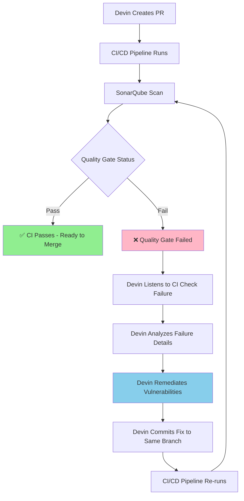
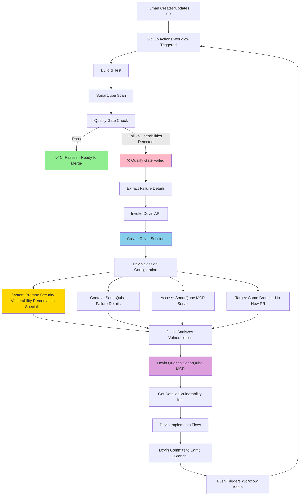
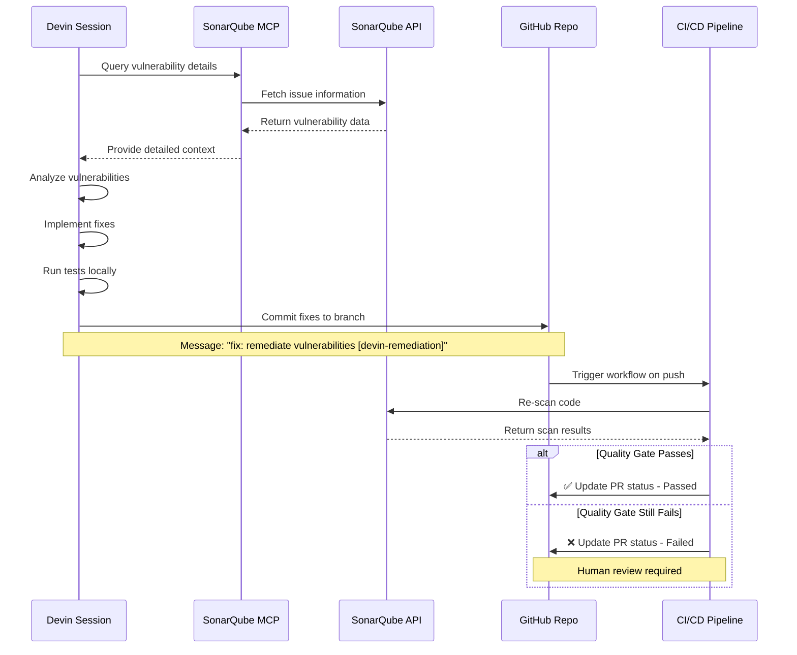

# CVE Remediation Workflow

This document describes the automated security vulnerability remediation workflow using Devin AI and SonarQube.

## Overview

The workflow handles two distinct cases for vulnerability remediation:
1. **Devin-initiated PRs** - Devin monitors and self-remediates
2. **Human-initiated PRs** - API-triggered Devin session for remediation

---

## Case 1: Devin-Initiated PR

When Devin creates a PR, it monitors the CI checks and automatically remediates any quality gate failures.



**Key Points:**
- Devin has native awareness of CI check status
- No API call needed - Devin monitors automatically
- Self-healing loop until quality gate passes
- All fixes committed to the same branch

---

## Case 2: Human-Initiated PR

When a human creates a PR and the quality gate fails, we trigger a Devin session via API to remediate vulnerabilities.



---

## Detailed Flow: Human-Initiated PR

### Step 1: Quality Gate Failure Detection

```yaml
- name: SonarQube Quality Gate Check
  id: quality-gate
  continue-on-error: true
  uses: SonarSource/sonarqube-quality-gate-action@master

- name: Extract Failure Details
  if: steps.quality-gate.outcome == 'failure'
  run: |
    # Get vulnerability details from SonarQube API
    VULN_DETAILS=$(curl -s -u "$SONAR_TOKEN:" \
      "https://sonarcloud.io/api/issues/search?componentKeys=PROJECT_KEY&types=VULNERABILITY&resolved=false")
```

### Step 2: Invoke Devin Session

```bash
curl -X POST "https://api.devin.ai/v1/sessions" \
  -H "Authorization: Bearer $DEVIN_API_KEY" \
  -H "Content-Type: application/json" \
  -d '{
    "name": "CVE Remediation - PR #123",
    "repo_url": "https://github.com/org/repo",
    "branch": "feature-branch",
    "system_prompt": "You are a Security Vulnerability Remediation Specialist...",
    "prompt": "SonarQube quality gate failed with X vulnerabilities...",
    "mcp_servers": ["sonarqube"]
  }'
```

### Step 3: Devin Session Configuration

**System Prompt:**
```
You are a Security Vulnerability Remediation Specialist with expertise in:
- OWASP Top 10 vulnerabilities
- Secure coding practices
- Dependency vulnerability management
- Code security analysis

Your task is to remediate security vulnerabilities detected by SonarQube.
You have access to the SonarQube MCP server to query detailed vulnerability information.

CRITICAL: Commit your fixes to the current branch. DO NOT create a new pull request.
```

**User Prompt:**
```
SonarQube quality gate failed for PR #123 with the following vulnerabilities:

[Vulnerability Details from API]

Tasks:
1. Use the SonarQube MCP server to get detailed information about each vulnerability
2. Analyze severity, affected files, and recommended fixes
3. Implement secure fixes following OWASP best practices
4. Ensure all tests pass
5. Commit changes with message: "fix: remediate SonarQube vulnerabilities [devin-remediation]"
6. Push to branch: feature-branch (this will update the existing PR)

Resources:
- SonarQube Dashboard: [URL]
- GitHub Actions Run: [URL]
```

### Step 4: Devin Remediation Process



---

## Workflow Implementation

### GitHub Actions Workflow Structure

```yaml
name: SonarQube Security Scan

on:
  pull_request:
    types: [opened, synchronize, reopened]

jobs:
  security-scan:
    runs-on: ubuntu-latest
    steps:
      - name: Checkout
        uses: actions/checkout@v4
      
      - name: Build & Test
        run: |
          # Build and test application
      
      - name: SonarQube Scan
        run: |
          # Run SonarQube analysis
      
      - name: Quality Gate Check
        id: quality-gate
        continue-on-error: true
        uses: SonarSource/sonarqube-quality-gate-action@master
      
      - name: Check if Devin Commit
        id: check-devin
        run: |
          if [[ "${{ github.event.head_commit.message }}" == *"[devin-remediation]"* ]]; then
            echo "is_devin_commit=true" >> $GITHUB_OUTPUT
          else
            echo "is_devin_commit=false" >> $GITHUB_OUTPUT
          fi
      
      - name: Trigger Devin Remediation
        if: |
          steps.quality-gate.outcome == 'failure' && 
          steps.check-devin.outputs.is_devin_commit == 'false'
        run: |
          # Extract vulnerability details
          # Call Devin API
          # Post PR comment with status
      
      - name: Fail if Quality Gate Failed
        if: steps.quality-gate.outcome == 'failure'
        run: |
          if [[ "${{ steps.check-devin.outputs.is_devin_commit }}" == "true" ]]; then
            echo "❌ Quality gate still failing after Devin remediation"
            echo "Human review required"
          fi
          exit 1
```

---

## Key Differences Between Cases

| Aspect | Case 1: Devin PR | Case 2: Human PR |
|--------|------------------|------------------|
| **Trigger** | Devin monitors CI natively | API call from workflow |
| **Detection** | Automatic via CI check | Explicit quality gate check |
| **Invocation** | Self-initiated | GitHub Actions triggers |
| **MCP Access** | Built-in | Explicitly configured |
| **Loop Prevention** | Devin manages | Commit message tagging |
| **Failure Handling** | Devin retries | Human review after 1 attempt |

---

## Loop Prevention Strategy

To prevent infinite remediation loops:

1. **Commit Message Tagging**: All Devin remediation commits include `[devin-remediation]` tag
2. **Detection Logic**: Workflow checks for tag before triggering new Devin session
3. **Single Attempt**: Only one Devin remediation attempt per human-initiated scan
4. **Human Escalation**: If Devin's fix doesn't resolve issues, human review is required

```bash
# Check if commit is from Devin remediation
if [[ "$COMMIT_MSG" == *"[devin-remediation]"* ]]; then
  echo "Devin remediation commit detected - skipping new session"
  SKIP_DEVIN=true
fi
```

---

## Success Criteria

### For Devin-Initiated PRs
- ✅ Quality gate passes after Devin's remediation
- ✅ All tests pass
- ✅ No new vulnerabilities introduced

### For Human-Initiated PRs
- ✅ Devin session successfully created
- ✅ Devin commits fixes to same branch
- ✅ Quality gate passes on re-scan
- ✅ PR updated with success status

### Escalation to Human
- ❌ Quality gate still fails after Devin remediation
- ❌ Devin session fails or times out
- ❌ Complex architectural changes required
- ❌ False positives need manual review

---

## Configuration Requirements

### GitHub Secrets
- `SONAR_TOKEN` - SonarQube Cloud authentication
- `DEVIN_API_KEY` - Devin AI API authentication

### SonarQube MCP Server
- Must be configured in Devin's environment
- Provides access to detailed vulnerability data
- Enables contextual remediation

### Branch Protection
- Require status checks to pass
- Require quality gate approval
- Prevent merge on failed security scans
